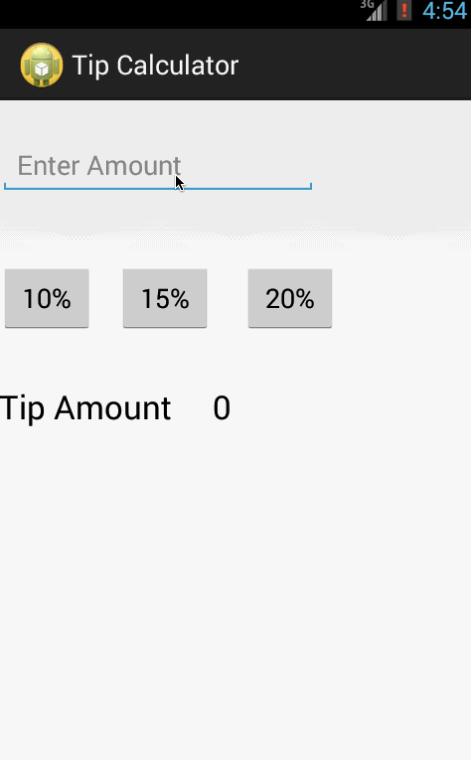

Tip Calculator
===============
A simple Tip Calculator.

Scope - 
=======
   * User is displayed the tip of specified percentage for specified entered amount
      * Enters the total amount of the transaction
      * Selects one of three tip amounts (10%, 15%, 20%)
      * Upon selecting tip %, tip value is displayed as $

Video Walkthrough - 
===================

